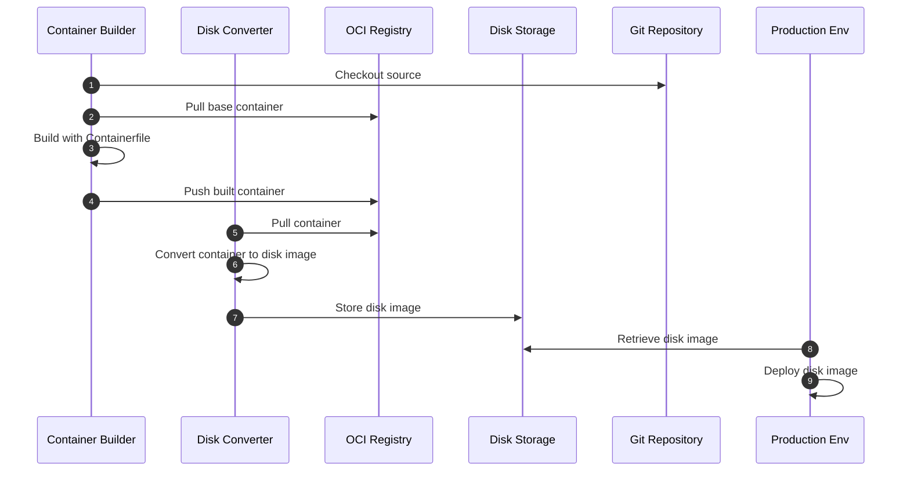

# YOB : Your own OS using bootc

## Index

<!-- no toc -->
- [Contributors](#contributors)
- [Introduction](#introduction)
- [Overall pipeline workflows](#overall-pipeline-workflows)
- [Quick Start](#quick-start-for-local-hands-on)

## Translation

- [한국어](./docs/README-KO.md)

## Contributors

<table>
  <tr>
    <td align="center"><a href="https://github.com/yureutaejin"> <b>
Yuntae</b></a> </td>
    <td align="center"><a href="https://github.com/charlie3965"> <b>
Chunsoo</b></a> </td>
</table>

## Introduction

Base project YOB referenced

- [bootc](https://bootc-dev.github.io/)

As everybody knows, The Linux container usually shares kernel with host OS,  
so that we can easily create a "Container" which is more lightweight and faster than Virtual Machine.

The bootc project uses the method in reverse to create OS using the Linux container techniques.  
Unlike usual OCI containers, the base OCI container (so called, bootable container) that bootc uses have below things already.

- Linux kernel
- Bootloader
- systemd
- System utilities & drivers

So we can create OS image using OCI container techniques which is familiar to modern developers/engineers.

## Overall pipeline workflows

Currently, this project is configured by following diagram below.

## Quick Start (for local Hands-on)

Quick start without editing few configurations.
This section targets that machine to deploy OS is Bare Metal (Laptop, Desktop, etc.)

### Prerequisites

- OS
  - Linux (RHEL Family is recommended)
- Podman
  - BIB(bootc-image-builder) uses `/var/lib/containers/storage` of host OS which podman, buildah, skopeo use.
  - `[[ -d /var/lib/containers/storage ]] || echo "Please install podman/buildah and pull any container first"`
- Docker
  - `curl -fsSL https://get.docker.com | sh`
- Make
  - To use `make` command for defined [tasks](./Makefile)
- OCI Registry
  - Get your account of OCI Registry (e.g. DockerHub, Quay.io, etc.)
  - Currently, Private Registry is not supported (will update guideline soon)
- Just define local variables in host shell without fixing Makefile (Refer to default value in [Makefile](./Makefile))
  - OCI_REGISTRY
  - OCI_IMAGE_REPO
  - OCI_IMAGE_TAG
  - OCI_REGISTRY_USERNAME
  - OCI_REGISTRY_PASSWORD
  - DEFAULT_DISK (e.g. nvme0n1, sda...)
- Machine to run OS you will create
  - Bare Metal (Laptop, Desktop, etc.)
  - Virtual Machine
  - Cloud

### 1. Build OCI Container

1. `make login-public-oci-registry`
2. `make build-bootc`
3. `make push-bootc`

### 2. Convert OCI Container to Bootable Disk Image

1. `make save-image-as-tar`
2. `make convert-to-disk-image`

### 3. Make bootable Disk

There are too many ways to make bootable disk.
Just leave Bare Metal case for now.

- (Bare Metal) Recommend to flash USB drive (3.0, color blue) with at least 8GB
  - [Ventoy](https://www.ventoy.net/en/index.html)
  - [BalenaEtcher](https://etcher.balena.io/)

### 4. Boot OS

Boot with created bootable disk
Since we've set host's config with [config.toml](./config.toml) already, Just wait until first booting is done.

### 5. Rollback/Upgrade/Switch OS

No need to make bootable disk again.
If you push new image to OCI Registry, It will be available in next reboot.
Just choose command and run it on running OS and reboot.

- `sudo bootc upgrade`
  - Upgrade to latest pushed image with same tag you booted
- `sudo bootc switch OCI_REGISTRY/OCI_IMAGE_REPO:OCI_IMAGE_TAG`
  - Switch to specified bootc image
  - e.g. `sudo bootc switch quay.io/fedora/fedora-bootc:latest`
- `sudo bootc rollback`
  - Rollback to previous image
  - (Important) OS will keep 1 previous image
