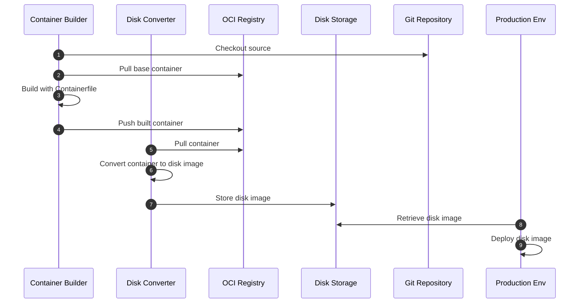

# YOB : Your own OS using bootc

## Index

<!-- no toc -->
- [Contributors](#contributors)
- [Introduction](#introduction)
- [Overall pipeline workflows](#overall-pipeline-workflows)
- [Quick Start](#quick-start-for-local-hands-on)

## Contributors

<table>
  <tr>
    <td align="center"><a href="https://github.com/yureutaejin"> <b>
Yuntae</b></a> </td>
    <td align="center"><a href="https://github.com/charlie3965"> <b>
Chunsoo</b></a> </td>
</table>

## Introduction

Base project YOB referenced

- [bootc](https://bootc-dev.github.io/)

모두가 알고 있듯이, Linux 컨테이너는 일반적으로 호스트 OS와 커널을 공유하므로,  
가상 머신보다 더 가볍고 빠른 "컨테이너"를 쉽게 만들 수 있습니다.

bootc 프로젝트는 이 방법을 역으로 사용하여 Linux 컨테이너 기술을 이용해 OS를 생성합니다.  
일반적인 OCI 컨테이너와 달리, bootc가 사용하는 기본 OCI 컨테이너(부팅 가능한 컨테이너라고 함)는 이미 다음과 같은 것들을 포함하고 있습니다.

- Linux kernel
- Bootloader
- systemd
- 시스템 유틸리티 및 드라이버

따라서 현대 개발자/엔지니어에게 친숙한 OCI 컨테이너 기술을 사용하여 OS 이미지를 만들 수 있습니다.

## Overall pipeline workflows

현재 이 프로젝트는 아래 다이어그램과 같이 구성되어 있습니다.

## Quick Start (for local hands-on)

구성을 거의 편집하지 않고 빠르게 시작하는 방법입니다.
이 섹션은 OS를 배포할 머신이 베어 메탈(노트북, 데스크톱 등)인 경우를 대상으로 합니다.

### 사전 요구사항

- OS
  - Linux (RHEL 계열 권장)
- Podman
  - BIB(bootc-image-builder)는 podman, buildah, skopeo가 사용하는 호스트 OS의 `/var/lib/containers/storage`를 사용합니다.
  - `[[ -d /var/lib/containers/storage ]] || echo "Please install podman/buildah and pull any container first"`
- Docker
  - `curl -fsSL https://get.docker.com | sh`
- Make
  - 정의된 [작업](./Makefile)에 `make` 명령을 사용하기 위해
- OCI Registry
  - OCI Registry 계정을 취득하세요 (예: DockerHub, Quay.io 등)
  - 현재 Private Registry는 지원되지 않습니다 (곧 가이드라인을 업데이트할 예정)
- Makefile을 수정하지 않고 호스트 쉘에서 로컬 변수를 정의하기만 하면 됩니다 ([Makefile](./Makefile)의 기본값 참조)
  - OCI_REGISTRY
  - OCI_IMAGE_REPO
  - OCI_IMAGE_TAG
  - OCI_REGISTRY_USERNAME
  - OCI_REGISTRY_PASSWORD
  - DEFAULT_DISK (예: nvme0n1, sda...)
- 생성할 OS를 실행할 머신
  - Bare Metal (노트북, 데스크톱 등)
  - Virtual Machine
  - Cloud

### 1. OCI 컨테이너 빌드

1. `make login-public-oci-registry`
2. `make build-bootc`
3. `make push-bootc`

### 2. OCI 컨테이너를 부팅 가능한 디스크 이미지로 변환

1. `make save-image-as-tar`
2. `make convert-to-disk-image`

### 3. 부팅 가능한 디스크 만들기

부팅 가능한 디스크를 만드는 방법은 너무 많습니다.
지금은 베어 메탈 경우만 남겨두겠습니다.

- (베어 메탈) 최소 8GB 이상의 USB 드라이브(3.0, 파란색)에 플래시하는 것을 권장합니다
  - [Ventoy](https://www.ventoy.net/en/index.html)
  - [BalenaEtcher](https://etcher.balena.io/)

### 4. OS 부팅

생성된 부팅 가능한 디스크로 부팅합니다
이미 [config.toml](./config.toml)로 호스트 구성을 설정했으므로, 첫 번째 부팅이 완료될 때까지 기다리기만 하면 됩니다.

### 5. OS 롤백/업그레이드/전환

부팅 가능한 디스크를 다시 만들 필요가 없습니다.
새 이미지를 OCI Registry에 푸시하면 다음 재부팅 시 사용할 수 있습니다.
명령을 선택하여 실행 중인 OS에서 실행하고 재부팅하기만 하면 됩니다.

- `sudo bootc upgrade`
  - 부팅한 것과 동일한 태그의 최신 푸시된 이미지로 업그레이드
- `sudo bootc switch OCI_REGISTRY/OCI_IMAGE_REPO:OCI_IMAGE_TAG`
  - 지정된 bootc 이미지로 전환
  - 예: `sudo bootc switch quay.io/fedora/fedora-bootc:latest`
- `sudo bootc rollback`
  - 이전 이미지로 롤백
  - (중요) OS는 1개의 이전 이미지를 유지합니다
